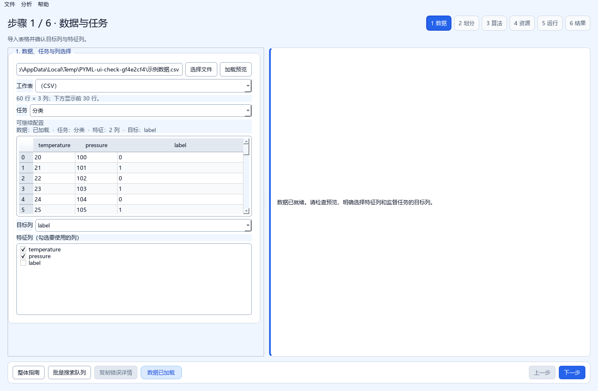
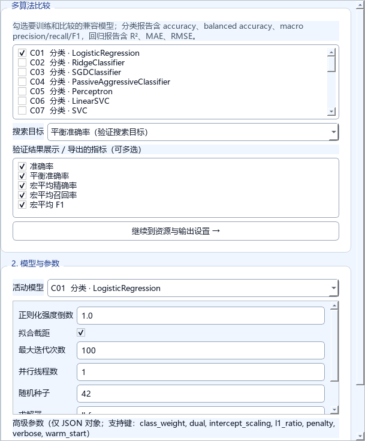
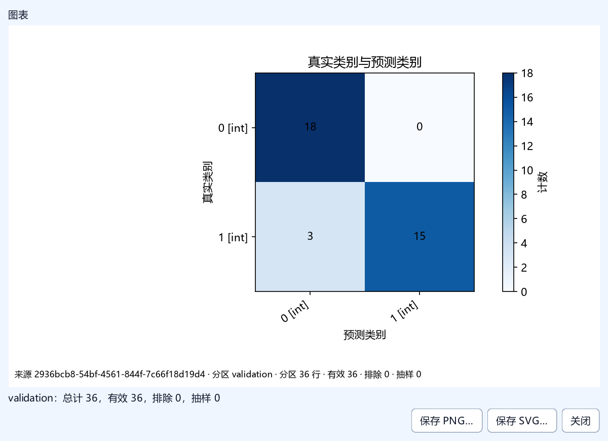
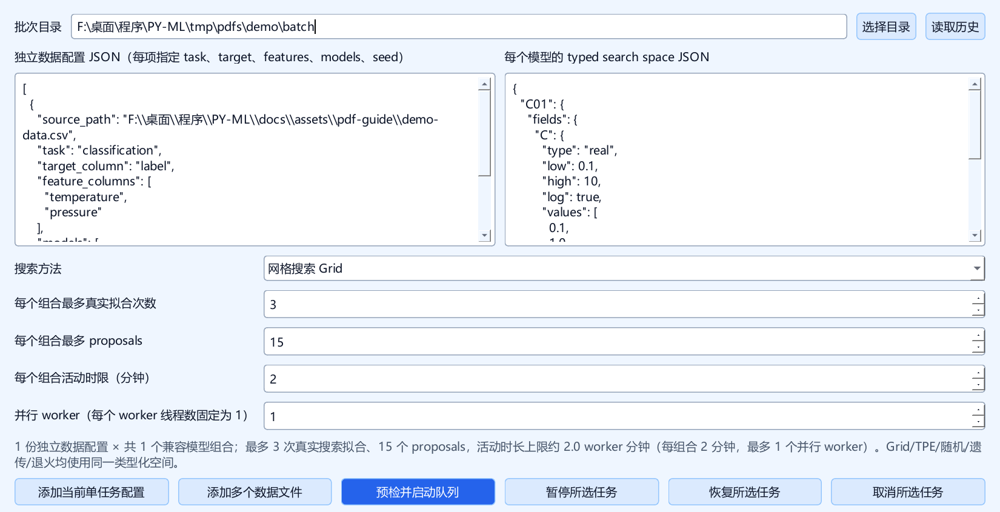

# PY-ML 工作台操作指南

适用版本：0.4.4 · 界面更新于 2026-10-08。面向 Windows 桌面用户和 Python 调用者。

工作台调用 scikit-learn、hmmlearn、PyTorch/skorch、Optuna、pymoo 和 SciPy 等开源组件。当前目录包含 84 个模型：71 个传统模型、6 个提升树模型、3 个隐马尔可夫模型（HMM）和 4 个深度模型。可用操作取决于模型和参数；每个模型并不都能对新样本预测。



*界面图解 · 使用合成示例数据展示，六步导航在右上方，常用工具和上一步 / 下一步集中在底部。*

## 1. 启动和阅读指南

**EXE 用户：** 完整解压所选的 profile ZIP，双击 `PYML-Workbench.exe`。保留同目录的 `PYML-Worker.exe` 与 `_internal`，搬到其他位置时复制整个文件夹。`standard` 包含桌面向导、71 个 scikit-learn 模型，以及 Grid/随机/退火搜索；`full` 还包含 HMM、PyTorch/skorch 深度模型、TPE 与遗传搜索。两种发行均不包含 XGBoost、LightGBM 或 CatBoost SDK。模型目录仍可浏览；当前环境缺少依赖的模型无法运行，模型列表会指出所缺模块和对应 extra。需要扩展功能时，请使用安装了相应 extras 的源码环境。

首次解压后启动可能需要等待几十秒；本机复制测量约 38 秒，后续启动约 3 秒。请等待主窗口出现，实际耗时取决于电脑和运行环境。

**源码用户：** 需要 Python 3.12 x64 和 uv，在项目根目录打开 PowerShell，执行：

```powershell
uv sync --locked --no-editable --no-dev --extra desktop
.\run_pyml_workbench.bat
```

要在源码环境中安装 HMM、深度模型与完整搜索，再在命令上追加 `--extra search --extra sequence --extra deep`。三种提升树 SDK 各自独立安装：XGBoost 用 `--extra xgboost`，LightGBM 用 `--extra lightgbm`，CatBoost 用 `--extra catboost`；`standard` 和 `full` 都不会自动安装这些 SDK。Grid、随机和退火不需要 `search` extra。

启动器使用项目已有的 `.venv`，也可执行：

```powershell
.\.venv\Scripts\python.exe -X utf8 -m pyml_workbench
```

只用传统模型时可以不安装 `sequence` 与 `deep`；只用网格、随机或退火搜索时可以不安装 `search`。不使用提升树时也可省略三个独立 SDK extras。缺少可选包不会阻止目录浏览或触发自动安装；选择模型时会提示所需 extra。修改源码后应重新安装本地包。安装命令中的 `--no-editable` 保证工作台读取已安装的版本。

主窗口底部点击 **“操作指南”**，或选择 **“帮助 → 操作指南”**，也可按 **F1**。指南在应用内离线显示，不需要网络。左侧目录可跳转章节，上方输入关键词后点击“下一个”或按 Enter；“上一个”反向查找，搜索到文末后会从头继续。指南窗口可与主窗口同时使用，关闭后可再次打开。发行目录中的 `docs/overall-guide.md` 是同一份文档，可用文本编辑器查看。

顶部“文件 / 分析 / 帮助”菜单在鼠标悬停时展开；移到“最近文件”等含子菜单的项目时继续展开下一层。可用项目悬停显示蓝色，不可用项目显示灰色。点击“帮助 → 联系（GitHub Issue）”可前往 [GitHub 新建 Issue](https://github.com/hexiovo/PY-ML/issues/new) 提交问题或建议；悬停不会打开网页。

## 2. 五分钟完成第一个实验

建议先用一份小型 CSV 做分类或回归，再尝试搜索和序列模型。

1. 准备表格：第一行是列名，每行是一条样本。例如特征 `temperature`、`pressure`，分类目标 `label`。普通任务至少需要 10 行；分类每个类别至少 3 行，样本越少越容易出现无法划分或评分不稳定。
2. 在“数据与任务”选择文件和工作表、任务类型、目标列及输入特征。目标列不能作为特征。
3. 在“预处理与划分”检查数据转换、固定 60/20/20 划分和 seed 42。预处理只在训练分区拟合。
4. 在“算法与评价”选择一个或多个适用模型，设置参数，并选择该任务支持的评价指标。第一次建议只选一个模型，先确认流程和结果。
5. 在“资源与输出”选 CPU worker、预算和新结果目录；只有 N01 且当前环境报告 CUDA 可用时才选 GPU。
6. 点击“下一步”进入“运行监控”。页面显示实际运行阶段、已完成组合、经过时间和估计剩余时间；某个模型完成后才会显示它真实计算出的指标。
7. 进入“结果与导出”，选择需要的指标、逐行预测、模型、图表或摘要及 CSV/XLSX/JSON/HTML 格式。最终测试仍需要先冻结配置，再执行一次。

单次实验适合确认数据和流程。需要同时比较多个模型或自动选参数时，转到第 7 节的批量搜索队列。

## 3. 界面布局和工作顺序

主窗口默认使用“上一步 / 下一步”的六步向导。每一步先检查当前输入，再继续；可返回修改前面的设置。原有高级入口仍可用于直接查看和编辑完整配置。

当前步骤标题右侧横向排列六个步骤入口，可直接点击切换；底部一行集中放置“操作指南”“批量搜索队列”“复制错误详情”、状态提示和“上一步 / 下一步”。

**表 1 · 默认向导的六个步骤**

| 步骤 | 主要操作 | 继续前检查 |
| --- | --- | --- |
| 1. 数据与任务 | 文件、工作表、任务、目标列、输入特征 | 目标和特征列符合所选任务 |
| 2. 预处理与划分 | 预处理说明、训练/验证/测试划分、随机 seed | 预处理只拟合训练分区，划分信息正确 |
| 3. 算法与评价 | 多个兼容算法、模型参数、评价指标和搜索目标 | 评价方式适用于任务与所选模型 |
| 4. 资源与输出 | CPU worker、搜索预算、可用的 N01 GPU、输出目录 | 当前环境具备选定资源，目录可写 |
| 5. 运行监控 | 实际阶段、已完成模型/组合、活动时长和 ETA | 指标只在模型真实计算后出现 |
| 6. 结果与导出 | 结果、图表、预测明细、模型和摘要 | 选择所需内容及输出格式 |

向导进度反映真实阶段与已完成的组合。剩余时间和预计完成时间根据当前活动时长及实际进展估算；尚未完成的模型不会显示预测准确率。分类与回归各自只显示可用指标。CPU worker 数按安全上限运行；GPU 只用于已实现 CUDA 路径的 N01，设备缺失时应选择 CPU。

“批量搜索队列”仍可直接打开用于持久化批次、历史恢复和高级预算控制。指南入口可随时打开，阅读不会启动训练或修改配置。

## 4. 数据准备、列选择与划分

支持 `.csv`、`.xlsx`、`.xls`。CSV 推荐 UTF-8；CSV 和 XLSX 已有实际样本验证。本轮还使用 xlwt 生成的合成 OLE/BIFF8 `.xls` 样本，经应用导入和预览核对两个工作表、六个字段、样本值、布尔值和日期类型；此结果仅覆盖该样本，不扩大为所有 XLS 文件的兼容保证。程序不改写源表，输出应使用新目录。

- 列名应唯一。监督任务目标不能为空；回归目标应为有效数值。若报编码、类型或格式错误，先检查原表。
- 分类/回归要选择目标列；聚类、降维、异常检测、HMM 不使用监督目标列。异常搜索评分需另行提供独立标签列，见第 7 节。
- 普通表格预处理仅在训练分区拟合；它能处理适用的数值/类别特征，但不能代替对错误单位、错误标签和异常记录的人工检查。序列模型还需满足数值或离散观测要求。
- 普通实验按固定 **60% 训练、20% 验证、20% 测试** 划分，默认 seed 42；分类使用分层抽样。验证集用于选择，测试集留到最终评估。
- 序列按组或连续顺序切分，窗口在切分后生成，不能跨组或跨分区。整组大小不同会使实际比例偏离 60/20/20，可查看“序列划分”页。
- 普通随机划分适合独立表格样本；若同一设备/人员重复出现或记录有时间依赖，应使用合适的序列配置并检查划分是否符合业务。

加载后打开“分析 → 数据概况…”，查看完整数据行列数、列类型、缺失数和描述统计。预览仅展示部分行，概况基于完整的已加载表格。


*图解 · 检查划分比例与随机种子后，再继续选择算法。*

## 5. 选择任务、模型和参数

**表 2 · 任务类型与常见模型**

| 目标 | 任务 | 常见起点或注意事项 |
| --- | --- | --- |
| 预测类别 | 分类 | C01 逻辑回归、树/森林、SVM 等；N01 为 MLP |
| 预测连续数值 | 回归 | 线性、树、核方法等；N02 为 MLP，N04/N06 为窗口回归 |
| 找样本群组 | 聚类 | KMeans 等；部分模型只能拟合已有样本，不能预测新样本 |
| 压缩特征/查看坐标 | 降维 | PCA 等；D10 t-SNE 没有新样本 transform |
| 找异常样本 | 异常检测 | IsolationForest、LOF 等；区分异常分数与真实标签 |
| 建模状态随序列变化 | 序列建模 / HMM | H01 Gaussian、H02 GMM、H03 Categorical |

模型下拉列表和 `docs/model-index.md` 给出实际条目及参数。传统算法使用成熟组件实现；不同模型有不同适用条件。

提升树模型为 C25–C27（XGBoost、LightGBM、CatBoost 分类）和 R24–R26（对应回归）。每个 SDK 都是独立可选 extra；启用后使用 CPU 并默认将数值线程设为 1。C25 将训练标签映射后再交给 XGBoost，并在预测与概率列中还原原始类别名。

常用参数直接填写。“高级参数”填写 **JSON 对象**，如 `{"max_iter": 500}`，使用双引号；布尔写 `true/false`，空值写 `null`。参数名称必须被当前模型支持，不要把搜索空间写进单任务高级参数。

SVC 若要预测概率，训练前需设置 `probability=true`；LOF 若要对新数据预测，训练前需设置 `novelty=true`。改变数据、列、模型或参数后，当前拟合结果会失效，应重新训练。浮点参数支持科学计数法，但不接受 NaN/Infinity。

随机 seed 控制划分；HMM 和深度模型还可设置模型 `random_state`，省略或为 `null` 时回退到划分 seed。相同 seed 有助于复现，但不保证不同依赖版本、硬件环境的结果逐位相同。



*图解 · 模型选择与评价指标位于同一步，首次使用建议从一个模型开始。*

## 6. 单任务验证、最终测试与导出

“训练并验证”只在训练行拟合预处理与模型，并显示 train/validation 指标。此时不计算测试分数。分类可关注 balanced accuracy 等指标，回归关注 RMSE 等误差；先结合样本量、类别分布和业务目标解读结果。

确认当前配置后点击“冻结模型设置”，冻结完成后再点击“执行最终测试（一次）”。按钮会随阶段改变文字；程序测试 **这个已经拟合的模型**，单任务不重新合并训练集与验证集拟合。重复点击不会创建第二次测试；失败或中断后的会话不能悄悄重测，应修正问题并建立新会话。不要根据最终测试分数反复改参数，否则会失去独立测试的意义。

模型不支持留出样本操作时，结果会明确显示不支持，而不是伪造测试分数。例如 t-SNE 无新样本变换，有些聚类算法无新样本预测。

设置结果目录后，正常最终化会保存：

**表 3 · 单任务主要导出文件**

| 文件 | 内容 |
| --- | --- |
| `config.json` | 数据路径、列、模型、参数、seed 等配置 |
| `metrics.json` / `.csv` / `.xlsx` | 实际可用的各分区指标 |
| `results.csv` / `.xlsx` | 模型实际支持的逐行输出及来源信息 |
| `model.joblib` | 已拟合预处理器和模型，供重载推理 |
| `model_manifest.json` | 模型/环境/能力说明 |

在“导出与审计”中打开文件或导出副本。结果目录应为空或不存在；已有产物和输入文件受覆盖保护。保存配置 JSON 不等于导出拟合模型。



*图解 · 这是合成示例的真实验证结果，实际实验以自己的数据与指标为准。*

## 7. 批量模型比较与自动调参

点击底部 **“批量搜索队列”**。有效的单任务配置会预填；可添加多个数据文件，每个数据项指定兼容模型列表，参数空间按模型分别设置。首次建议 1 个 worker、每组合 3～10 次拟合，先确认数据和目标。



*图解 · 数据 JSON 与搜索空间分别设置，先以较小预算确认流程。*

**先选稳定的批次目录。** 默认目录位于系统临时目录，长期保留任务时应改到自己管理的目录。`history.sqlite3`、数据快照、候选会话、冻结选择和最终会话要一起保留，不能仅复制 SQLite 文件。入队时固定数据快照，恢复使用快照；之后修改源文件不会改动已入队数据。

示例：在数据 JSON 中填写（路径替换为自己的文件）：

```json
[
  {
    "source_path": "D:/datasets/data.csv",
    "task": "classification",
    "target_column": "label",
    "feature_columns": ["temperature", "pressure"],
    "models": ["C01"],
    "seed": 42
  }
]
```

搜索空间 JSON 示例，针对 C01 的 `C`：

```json
{
  "C01": {
    "fields": {
      "C": {
        "type": "real",
        "low": 0.1,
        "high": 10.0,
        "log": true,
        "values": [0.1, 1.0, 10.0]
      }
    },
    "fixed": {"max_iter": 500}
  }
}
```

`fields` 描述要搜索的参数，`fixed` 是固定参数。可用类型为 `real`（有限实数范围）、`integer`（整数范围）、`choice`（离散值列表）；条件参数可使用 `when`。网格中的每个字段必须给 `values`。`random_state` 和 `n_jobs` 不能作为搜索变量。

**表 4 · 批量搜索方法**

| 方法 | 推荐场景 | 规则 |
| --- | --- | --- |
| Grid / 网格（遍历） | 候选少、需要检查每种组合 | 枚举各字段 values 的笛卡尔积，受预算限制 |
| Random / 随机 | 范围较大，先快速探索 | 数值按 low/high 抽样，choice 按 values 选取 |
| TPE | 希望利用已有试验逐步改善 | Optuna 后端，支持混合/条件参数；需要 search 依赖 |
| Genetic / 遗传 | 连续、整数和离散混合空间 | pymoo 后端；需要 search 依赖 |
| Annealing / 退火 | 主要优化连续实数参数 | 至少一个 real 字段；integer/choice 需在基础 parameters 中给固定值，不会搜索这些离散字段 |

数字字段的 `values` 只用于网格枚举；随机/TPE/遗传依据范围搜索，不能认为只会尝试列表中的数字。参数范围应结合模型和数据设定。自动调参返回 **给定空间、验证目标和预算内找到的最好候选**，不保证全局最优。

**评分目标：** 分类默认最大化 balanced accuracy；回归最小化 RMSE；聚类最大化有效 silhouette（有覆盖率要求）；降维最大化 trustworthiness；HMM 最大化每观测对数似然。异常检测自动搜索需要独立的 `objective_labels_column`，评分标签须有异常 -1 和正常 +1，可用 `label_mapping` 映射；它不能作为输入特征。没有留出操作/有效分数的模型无法成为验证 winner。`train_exploratory` 只做训练探索，不进入验证榜，不能冻结或最终测试。

**预算按每个“数据集 × 模型”组合计算：** 最多 50 次真实搜索拟合、250 次 proposals（提案）、1200 秒活动时长；可设置更低值。队列最多 2 个 worker，每个 worker 的数值线程为 1。无效/重复提案可能占 proposal，缓存命中不增加真实拟合数，已经进入 fit 的失败会消耗拟合预算。活动时限在检查点生效，不保证立即中断正在执行的拟合；暂停等待时间不计入活动时长。

操作顺序：

1. 检查数据/搜索 JSON 和预算，点击“预检并启动队列”。预检不拟合模型。
2. 查看任务状态、候选和验证结果。不同数据/划分/目标的任务分组比较，不能直接混排分数。
3. 从历史表选择任务，可暂停、恢复或取消；暂停在安全检查点生效。读取历史需保留配套快照/会话。
4. 对 completed 且有验证 winner 的任务点击“冻结所选验证 winner”。
5. 点击“重拟合并执行一次最终测试”：创建新模型，在训练+验证数据（普通划分约 80%）上拟合，再对测试集评估一次。此流程与第 6 节单任务不同。
6. 结果位于批次目录 `exports/<job_id>`，可导出对比 CSV。重复读取最终结果返回缓存，不再次拟合/测试。训练探索任务通过“导出训练探索 winner”保存已有训练会话。

## 8. HMM、LSTM、GRU 与深度学习

H01/H02 是连续数值观测 HMM；H03 只接受一列离散观测。隐藏状态编号是潜在状态，大小没有等级含义，也不是用户真实分类标签；不同拟合可交换状态编号。H03 的类别编码从训练数据冻结，后续出现未见符号会报错。

N01 为 MLP 分类，N02 为 MLP 回归；N04 为 LSTM 窗口回归，N06 为 GRU 窗口回归。深度模型使用 CPU，常用参数有 `hidden_size`、`num_layers`、`batch_size`、`learning_rate`、`weight_decay`、`max_epochs`、`patience`，`max_epochs` 最多 100。

选择 HMM、N04 或 N06 后，可编辑“序列配置 JSON”。例：

```json
{
  "group_column": "device_id",
  "time_column": "timestamp",
  "order_mode": "time",
  "window": 10,
  "horizon": 1
}
```

HMM 可加入 `"observation_columns": ["temperature", "pressure"]`。组/时间/目标列为结构列，不能作为输入特征；有效组/时间配置会自动取消勾选这些列。时间列必须配合 `order_mode: "time"`，组内无效、缺失或重复时间会被拒绝。

留空或 `{}` 按源表行顺序作为一条序列处理，默认 window 10、horizon 1。组内先排序并切分，再生成窗口；每个分区/组必须有足够行构造有效窗口。窗口 [i, i+window) 的预测目标是 i+window+horizon-1；window 10、horizon 1 用第 0～9 行预测第 10 行（零起始）。没有组列时连续切分；有组列时整组分配，各分区应有足够组和样本。

“序列划分”页列出实际源行、组、窗口数。“训练曲线”页使用实际 skorch 逐 epoch 记录；深度训练按验证损失早停并恢复最佳权重。批量最终重拟合使用冻结的 selected epoch 和 seed，合并训练+验证后不再次用验证或测试选择 epoch。HMM 不产生深度训练曲线。

重载序列模型时，保存的组/时间/window 配置会自动用于新 CSV。HMM 输出每源行的隐藏状态和后验概率；N04/N06 输出每个有效目标行的预测，并附窗口源行映射。位置对应新 CSV，窗口不会跨组。

## 9. 数据图表与结果解释

“分析 → 基础图表…”使用完整已加载表格：数值直方图、类别计数、数值散点图、相关性图。“分析 → 绘制结果图…”及批量窗口的同名入口使用已经完成并核验的结果缓存。

**表 5 · 结果类型与可查看图表**

| 场景 | 可查看的图 |
| --- | --- |
| 分类 | 真实类别与预测类别的混淆矩阵；新训练且缓存了有效分数时可画逐类 ROC 与精确率-召回率曲线 |
| 回归 | 实际值/预测值、残差 |
| 聚类/降维 | 模型已有坐标上的分组/投影 |
| HMM | 隐藏状态、各状态后验概率 |
| 深度模型 | 实际记录的训练/验证损失曲线 |

支持的模型还可画真实 `feature_importances_` 或 `coef_`。特征名取自已拟合的预处理器输出，系数图保留方向和类别信息。批量指标图只比较数据、划分、特征、目标、评分指标和分区均一致的完成记录。旧缓存若没有分数、解释量或对应校验清单，不会补算或伪造新图；按当前版本重新训练后可生成新的缓存。

先选择一个来源和分区，再选择字段；可用图型取决于实际缓存字段。test 图只在本次最终测试成功且回执/来源有效后开放。每张图只用一个分区，图注说明总行、有效行和排除行；序列时间轴显示 UTC。

图窗可另存 PNG 或 SVG。绘图不会重新训练、预测、搜索或测试。旧结果缺少对应绘图清单/sidecar 时，该来源不可绘图；可以正常查看既有结果，或按正常流程建立新实验。t-SNE 没有留出变换，不能给新样本/test 伪造投影。

## 10. 保存配置、历史和新数据推理

“文件 → 保存参数配置 JSON…”保存当前数据路径、列、模型、参数、seed、序列设置和结果目录；不复制原始数据或拟合结果，也不开始训练。“加载参数配置 JSON…”经过校验后回填，数据路径仍存在时会恢复预览；文件缺失时需要重新选择。后台运行期间不能加载配置。

“文件 → 最近文件”最多记住 10 个成功加载的路径；不存在的文件会标记并禁用。清除记录只删除记忆的路径。

在右侧“已加载模型的推理”中：

1. 选择自己导出的 `model.joblib` 并点击“加载模型”。只加载可信来源的 joblib 文件；此格式可在反序列化时执行代码。
2. 选择新数据和所需操作。界面只启用该模型实际支持的 predict、predict_proba、decision_function、score_samples 或 transform 等能力。
3. 新表必须包含训练特征；序列模型还需包含保存的组/时间结构列。点击“运行推理并导出 CSV”。
4. 输出使用新文件，已有目标不覆盖。HMM/窗口模型输出含源行/组/窗口映射，便于对照原表。

模型依赖版本也会影响重载。升级前保留旧模型、配置和环境版本，跨版本兼容性不能只凭文件名判断。

## 11. 日志、错误编号与诊断

右侧“阶段日志”显示当前任务进度。异常时点击底部“复制错误详情”，保存 **error_id、错误说明和 traceback**。日志默认在 `%LOCALAPPDATA%\PyMLWorkbench\logs`；“文件 → 选择日志目录…”可切换后续日志，“恢复默认日志目录”切回默认位置，旧日志保留在原处。

“文件 → 打开统一操作日志…”会用系统关联的文本程序打开持续追加的 UTF-8 操作记录；源码运行时文件位于项目目录，打包运行时位于 EXE 目录。记录包含操作名称和任务结果，不保存所选文件路径或参数输入原文。

“文件 → 导出诊断包…”可选当前 GUI 会话或输入历史 32 位错误编号，然后选择 ZIP 保存位置。诊断包按白名单收集并脱敏，最多 20 MiB，只在本机保存，不上传，已有文件不覆盖。提供给维护者前仍应自行查看内容是否可分享。

报错后建议保存：应用版本、使用入口（EXE/Python）、任务/模型 ID、参数配置、error_id、诊断 ZIP、复现步骤。数据有保密要求时，提供能复现的合成小样本。修正输入/参数后再建立新任务，不手工改 SQLite、模型回执或测试计数。

偏好设置默认在 `%APPDATA%\PY-ML\preferences.json`，与实验配置分开。若日志目录不可写，界面会提示；可换到有权限的本地目录。

## 12. Python API 与开发入口

Python 包名为 `pyml_workbench`。EXE 用于桌面使用；调用 API 时需安装 Python 包及对应 extras。下面以真实 CSV 的两列特征和分类目标为例，先替换路径/列名：

```python
from pyml_workbench import (
    DatasetConfig, ExperimentConfig, SplitConfig,
    prepare_experiment, freeze_experiment, evaluate_test,
    load_model, predict,
)
import pandas as pd

config = ExperimentConfig(
    dataset=DatasetConfig(
        source_path="data.csv",
        target_column="label",
        feature_columns=("temperature", "pressure"),
    ),
    task="classification",
    model_id="C01",
    parameters={"max_iter": 500},
    split=SplitConfig(seed=42),
    output_dir="run-output",  # 新目录
)
session = prepare_experiment(config)
print(session.metrics["validation"])
# 检查验证结果后，冻结同一份配置。
freeze_experiment(session, expected_config=config)
result = evaluate_test(session)
print(result.metrics.get("test"))
model = load_model("run-output/model.joblib")
print(predict(model, pd.read_csv("new-data.csv")))
```

单任务快捷 `run_experiment` 会完成一次测试，需检查验证后再确定方案时使用上述三阶段 API。批量使用 `run_batch` 或 `create_search_jobs → run_search_jobs → load_search_result → freeze_search_winner → finalize_frozen_search`。序列配置使用 `SequenceConfig`。

项目示例：`examples/synthetic_classification.py`、`synthetic_dimensionality_reduction.py`、`synthetic_batch.py`、`synthetic_extended.py`；它们使用临时合成数据。详细字段与完整批量调用见 `docs/api-guide.md` 和 `docs/batch-guide.md`。

## 13. 常见问题与下一步

**表 6 · 常见问题与处理方式**

| 现象 | 处理方式 |
| --- | --- |
| EXE 启动失败或找不到依赖 | 重新完整解压 ZIP，保留 worker/_internal；不要只移动 EXE |
| 缺少 HMM/deep/search 包 | 源码环境安装对应 extra；EXE 应完整使用发行包 |
| 提升树模型显示缺少依赖 | 按模型提示只安装所需的 `xgboost`、`lightgbm` 或 `catboost` extra；标准版和完整扩展版 EXE 都不含这些 SDK |
| 数据无法读取 | 核对文件格式、工作表、编码、唯一列名和访问权限 |
| 监督目标缺失/样本不够 | 补正目标、增加样本，检查类别数及每类样本数 |
| JSON 或参数无效 | 使用双引号及 JSON true/false/null，核对模型参数名与范围 |
| 没有有效验证 winner | 查看候选失败原因、模型留出能力、评分目标和预算；聚类可能只有一簇或有效覆盖不足 |
| 退火拒绝离散参数 | 连续字段用 real，离散字段在基础 parameters 固定；要搜索离散值换其他方法 |
| 搜索提前停止 | 检查 fit_limit/proposal_limit/time_limit/space_exhausted；预算按组合计算 |
| 恢复失败 | 核对批次目录、history.sqlite3、快照/模型是否完整，配置指纹是否一致 |
| 序列没有窗口/时间无效 | 每个组/分区需足够行，降低 window/horizon 或增加数据，检查重复时间 |
| ROC/PR 或特征解释图不可用 | 使用有真实类别分数/解释量和校验清单的新训练缓存；旧缓存不会推算，按当前版本重新训练 |
| 结果图按钮不可用 | 先加载数据或完成相应任务；test 需成功最终测试，旧缓存可能缺绘图清单 |
| 新数据无法推理 | 补齐训练特征/结构列，检查模型是否支持所选操作及参数开关 |
| 最终测试失败后不能重试 | 保存错误和日志，修正后建立新会话，保留原失败记录 |

建议路线：先完成单模型 → 检查数据和图表 → 小预算比较两三种模型 → 固定参数空间扩大搜索 → 冻结验证方案 → 一次最终测试 → 保存模型并对新数据推理。

完整专题文档随发行目录保存：`docs/user-guide.md`（单任务）、`docs/batch-guide.md`（批量）、`docs/sequence-guide.md`（序列）、`docs/deep-learning-guide.md`（深度）、`docs/api-guide.md`（API）、`docs/model-index.md`（模型/参数）、`docs/third-party.md`（来源/许可证）、`docs/exe-guide.md`（EXE）、`docs/development.md`（开发）。更新记录见 `version.md`。

当前在 Windows 11 x64 本机检查；未验证干净虚拟机、其他 Windows 版本、GPU 或所有用户数据。模型能运行不等于预测质量合格，最终判断应结合独立评估和业务要求。
